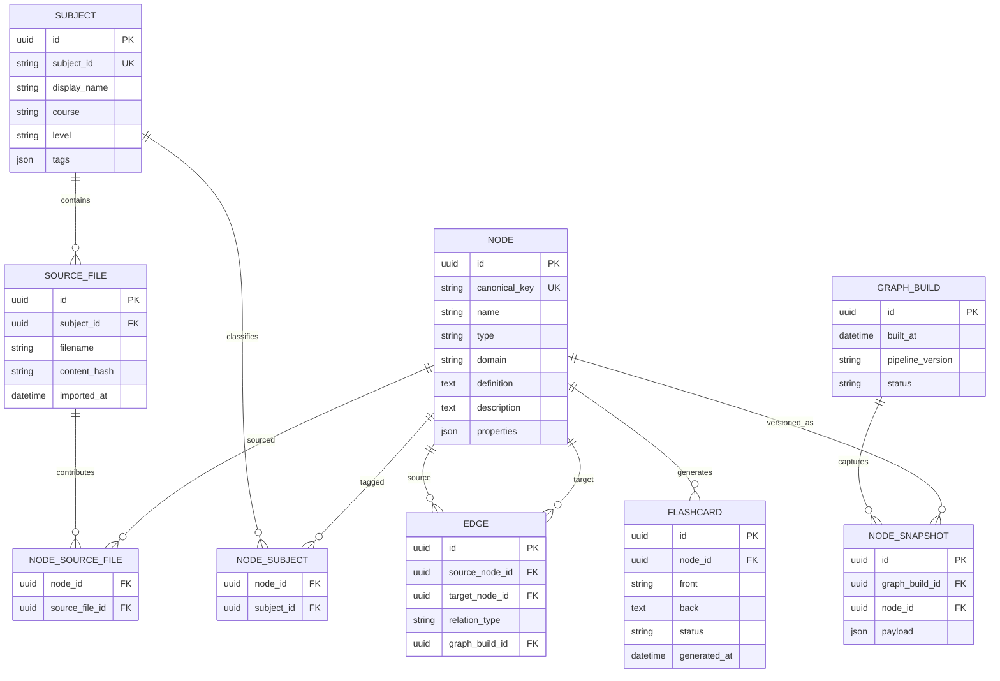

# Entity Relationship Diagram

The repository currently stores generated artifacts as JSON rather than using a relational database. This is the logical target model for persistence; it also documents the relationships represented by the current artifacts.

## Relationship Notes

- `SUBJECT` maps to a current subject folder and the `metadata.subjects` graph metadata.
- `SOURCE_FILE` records the JSON filename that contributed a node; `content_hash` supports change detection.
- `NODE` is the canonical concept/entity. `canonical_key` should eventually replace display-name matching.
- `EDGE` represents a directed typed relation such as `requires`, `related_to`, or `generalizes`.
- `FLASHCARD` is derived from a node and can later hold scheduling or mastery fields.
- `GRAPH_BUILD` and `NODE_SNAPSHOT` make generated artifacts reproducible and diffable.
- `NODE_SUBJECT` and `NODE_SOURCE_FILE` are many-to-many join tables. They are shown explicitly because one node can occur in multiple subjects and files.

## Current JSON Mapping

| Logical entity | Current representation |
| --- | --- |
| Subject | Folder under `json_nodes/<subject_id>/` and `data/graphs/merged_graph.json.metadata.subjects` |
| Source file | `metadata.source_files[]` on each merged node |
| Node | `data/graphs/merged_graph.json.nodes[entity]` |
| Edge | `data/graphs/merged_graph.json.edges[]` with `source`, `target`, and `type` |
| Flashcard | Entry in `data/flashcards/flashcards.json` |
| Graph build | Top-level graph `metadata.built_at`; full build history is not yet retained |
| Node snapshot | Not currently persisted; node properties are stored in the latest merged artifact |

## Integrity Rules

- `subject_id`, `canonical_key`, and `filename` are unique within their respective scopes.
- An edge must reference valid source and target nodes after normalization.
- Duplicate edges should be prevented by `(source_node_id, target_node_id, relation_type, graph_build_id)`.
- Deleting a node must either remove dependent edges/cards or mark the node inactive; cascading behavior should be chosen before persistence is implemented.
- A flashcard should not be published when its source node lacks a usable definition or description.
