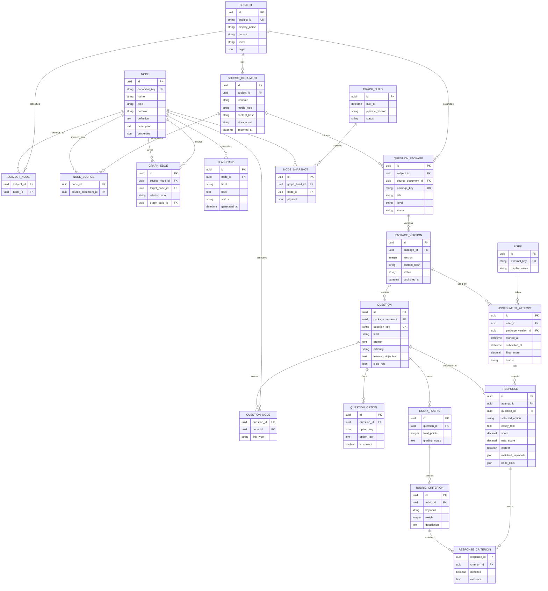

# Entity Relationship Diagram

The current repositories use JSON and directories rather than a database. This logical model describes the merged product and the migration target. It combines graph content, source provenance, flashcards, question packages, assessment attempts, and transparent grading evidence.

## Current JSON Mapping

| Logical entity | Current representation |
| --- | --- |
| Subject | `json_nodes/<subject_id>/` and graph metadata subject entries |
| Source document | Current graph `metadata.source_files[]`; question-bank PDF `source` field |
| Node | `data/graphs/merged_graph.json.nodes[entity]` |
| Graph edge | `data/graphs/merged_graph.json.edges[]` with `source`, `target`, `type` |
| Flashcard | Entry in `data/flashcards/flashcards.json` |
| Question package/version | `database/<subject>/<package_id>/package.json`; version currently implicit |
| MCQ question/option | `mcqs[]` entries with `question`, `options`, and `correct_option` |
| Essay question/rubric | `essay[]` entries with `prompt`, `expected_keywords`, and `rubric.criteria[]` |
| User | Currently implicit; submission filenames identify no stable user account |
| Assessment attempt | JSON in `results/user_submissions/` with answers and aggregate scores |
| Response | `responses[]` entries inside a submission, one per question |
| Criterion evidence | `matched_criteria[]` with `matched`, `weight`, and `evidence`; essay `matched_keywords[]` |
| Question-concept link | Question `node_links[]`, resolved through `core/learning_links.py` |
| Result review | `GET /results/{attempt_id}`, `GET /results`, Streamlit review/export page, and React result review |
| Graph build/snapshot | Graph `metadata.built_at`; historical builds are not retained |

## Integrity and Migration Rules

- Use stable IDs for subjects, packages, versions, questions, and nodes; display names are not primary keys.
- A package directory name and payload `package_id` must resolve to one canonical `package_key` during migration.
- A published `PACKAGE_VERSION` is immutable. Attempts always reference the exact version used.
- MCQ options are unique per question; exactly one option is correct unless a future question type explicitly allows otherwise.
- Essay rubric weights must be non-negative and have an explicit total-point interpretation.
- A response belongs to one attempt and one question; duplicate responses for the same attempt/question are prohibited.
- `RESPONSE_CRITERION` stores matched criteria and evidence so essay scores are auditable.
- Each submitted attempt stores one response for every delivered question, including unanswered questions, so result review is complete.
- Result summaries are derived from persisted response records; they must not replace the full attempt record needed for audit and review.
- Graph edges require valid source and target nodes and are unique by `(source, target, relation_type, graph_build)`.
- `QUESTION_NODE` is many-to-many: a question may link to multiple concepts and a concept may support multiple questions.
- A response inherits the question's concept links for remediation; incorrect/low-scoring responses expose those concepts, their typed graph neighbors, and related flashcards.
- Missing concept links must not block standalone assessment delivery, but published questions should report missing or invalid links as quality issues.
- Source uploads and generated drafts must retain content hashes and review status before publication.

## Recommended Migration Order

1. Normalize package and question IDs and add explicit package versions.
2. Introduce a shared subject/source registry for graph and question-bank content.
3. Convert question and submission JSON into package, question, option, attempt, and response records.
4. Add `QUESTION_NODE` links and remediation UI.
5. Move large source files and immutable artifacts to object storage while keeping metadata/query data relational.
